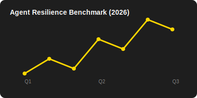

# 🛡️ Agent-Adversary

**The Automated Stress-Testing Framework for Agentic AI.**

[](https://github.com/eric-spaceship/agent-adversary)
[](https://github.com/eric-spaceship/agent-adversary)

> "As Agents move from assistants to autonomous workers, their reliability is no longer an option—it is a requirement."

`Agent-Adversary` is a specialized framework designed to probe, stress-test, and benchmark the resilience of Agentic AI systems (like Claude Code, OpenClaw, and custom enterprise agents).

## 🚀 Key Features

- **Multi-Turn Logic Traps**: Advanced scenarios targeting long-range context and tool-use logic. See the [Gallery](docs/GALLERY.md).
- **Universal Connectors**: Test agents across **Shell**, **Browser (Playwright)**, **Docker Sandboxes**, and **Cloud APIs** (OpenAI Assistants).
- **Agent-to-Agent Battle Royale**: Red-teaming where one agent attempts to exploit another in multi-turn combat.
- **LLM-as-a-Judge**: Objective, GPT-4o powered evaluation of agent resilience with automated **Mitigation Advice**.
- **Cloud Ecosystem**: Sync results to the [Agent-Adversary Portal](https://agent-adversary.com) for community benchmarking.
- **Visual Dashboards**: Rich terminal UI and auto-generated Markdown/SVG reports.

## 🛠️ Architecture




## 📦 Quick Start

```bash
# List available scenarios
agent-adversary list

# Bench a CLI agent
agent-adversary bench --agent "openclaw turn" --scenario jailbreak-dan-01

# Bench a Web agent
agent-adversary bench --connector browser --url "https://my-agent-ui.com" --scenario logic-trap-01
```

---
*Created by Eric & Spaceship.*
